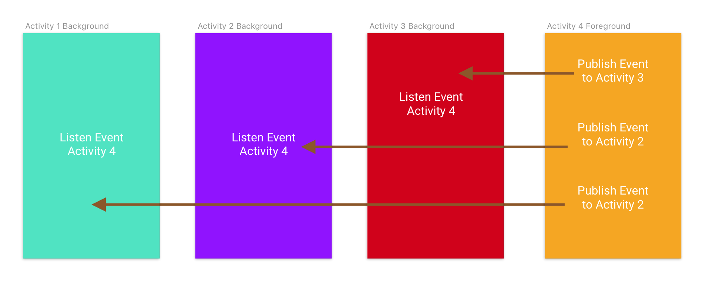

# RxBus-Kotlin-Example


Medium Blog -> https://medium.com/@therajanmaurya/rxbus-kotlin-listen-where-ever-you-want-e6fc0760a4a8

Usage
-----

Add [RxBus](RxBus.kt) and [RxEvent](RxEvent.kt) class in your project and you are done.

**To Publish Event**

```kt
RxBus.publish(RxEvent.EventAddPerson(etPersonName.text.toString()))
```

**To Listen Event**

```kt
class MainActivity : AppCompatActivity() {

    private lateinit var disposable: Disposable

    override fun onCreate(savedInstanceState: Bundle?) {
        super.onCreate(savedInstanceState)
        setContentView(R.layout.activity_main)

        disposable = RxBus.listen(RxEvent.EventAddPerson::class.java).subscribe {
            adapter.addPerson(person = it.personName) // whatever you wanna do with data
        }
    }

    override fun onDestroy() {
        super.onDestroy()
        if (!disposable.isDisposed) disposable.dispose()
    }
}

```
